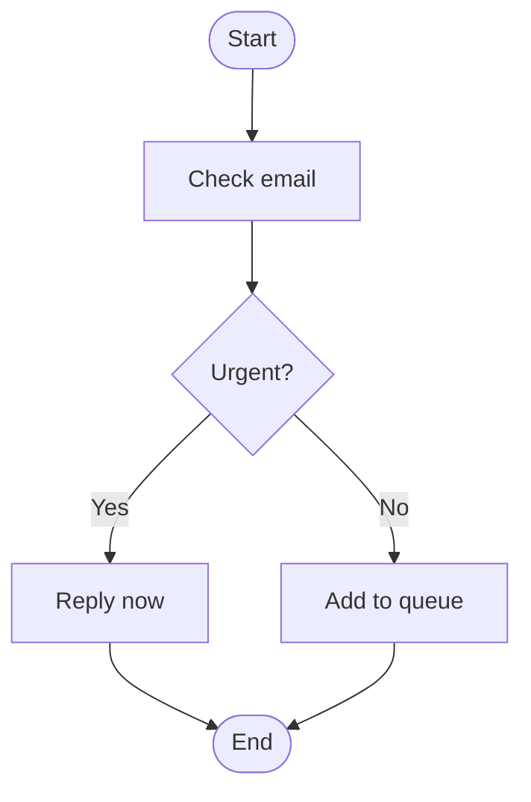

# Worked Example — Node/Branch/Label Output

This walks one piece of input text through the domain model defined in `CONTEXT.md`, showing the parsed `nodes`/`edges` lists and the resulting Mermaid diagram.

## Example input text

> "Check email. If it's urgent, reply now. Otherwise, add it to the queue."

## Parsed lists

```python
nodes = [
    StartNode(id="start", label="Start"),
    Step(id="n1", label="Check email"),
    Decision(id="n2", label="Urgent?"),
    Step(id="n3", label="Reply now"),
    Step(id="n4", label="Add to queue"),
    EndNode(id="end1", label="End"),
]

edges = [
    Branch(source_id="start", target_id="n1", label=None),   # plain transition, not a labeled branch
    Branch(source_id="n1",    target_id="n2", label=None),
    Branch(source_id="n2",    target_id="n3", label="Yes"),  # Decision fan-out
    Branch(source_id="n2",    target_id="n4", label="No"),
    Branch(source_id="n3",    target_id="end1", label=None),
    Branch(source_id="n4",    target_id="end1", label=None),
]
```

**Note:** per `CONTEXT.md`, only edges *out of a `Decision`* are semantically "branches" with a label — the `start→n1`, `n1→n2`, `n3→end1`, `n4→end1` edges are plain unlabeled transitions. If the `Branch` model requires a non-empty label for every edge, the plain-transition case would instead need a separate lightweight `Transition`/`Edge` type. Mixing both under one `Branch` type with an optional label (as above) is one reasonable resolution, but not the only one — worth a deliberate decision if this hasn't been pinned down elsewhere.

## Generated Mermaid



## Rendering rules used

The shape syntax (`([...])`, `[...]`, `{...}`, `-->|label|`) is defined by Mermaid — fixed flowchart syntax, not our invention. The *mapping* from our domain types to those shapes is our own convention (Mermaid supports other shapes — subroutine, cylinder, hexagon, etc. — we're just not using them; diamond-for-decision is the standard flowchart convention we chose to follow):

| Our type | Mermaid shape/syntax (Mermaid-defined) |
|---|---|
| `StartNode` / `EndNode` | stadium shape `([...])` |
| `Step` | rectangle `[...]` |
| `Decision` | diamond `{...}` |
| `Branch` with a label | `-->|label|` |
| Unlabeled edge | plain `-->` |

**Gotcha:** Mermaid treats `end` as a reserved keyword — an `EndNode` id must avoid the bare string `end` (e.g. `end1`, as used above), or the diagram silently fails to render.
